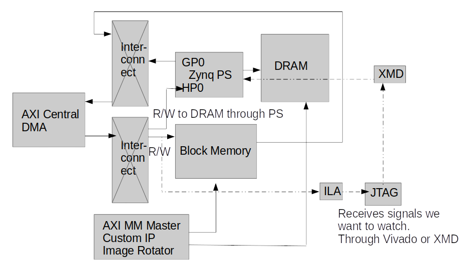
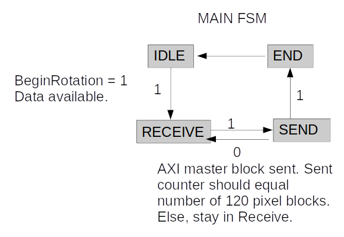
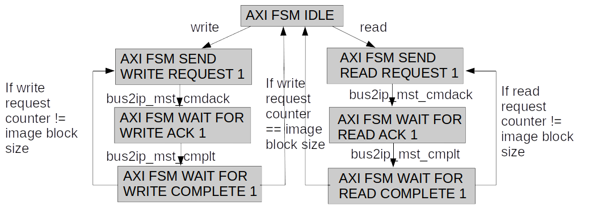
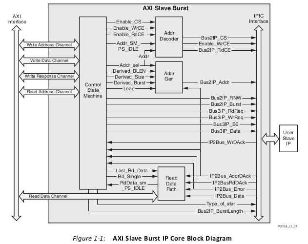
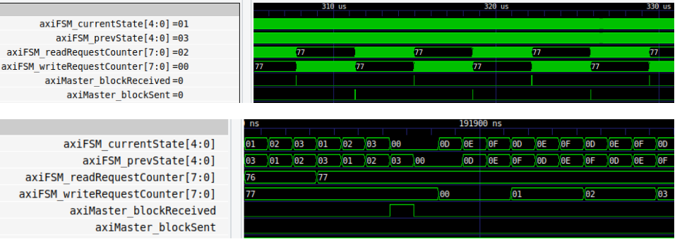

# image_rotator
Image Rotator AXI Stream Interface
Jaehee Park, April 2020

AXI Stream Protocol

The AXI protocol provides the infrastructure of the IP and the communication between two or more IPs. The standard protocol not only allows the data to be interpreted universally amongst multiple IP’s with a standard format, which eliminates unnecessarily reprogramming basic communication blocks, but also allows IPs to communicate via axi4 stream protocols with memory mapped components. Xilinx comes with many pre-existing IP blocks that facilitate the design of complex systems. A custom IP block that contains unique functionalities specific to your design, can be created within vivado. Through Vivado’s RTL flow we can create a block and package them, and later synthesize and simulate signals through the Vivado interface. This RTL flow compiles our own custom vivado code which allows complete control of the flow of operations (the finite state machine), definition of ports, and the communication with other blocks like the Zynq PS and memory. 

AXI components require a sequence of AXI signaling events. For example, an IP that creates samples that are increasing by 1 in each clock cycle until a packet is completed will need to coordinate the correct order AXI signaling needed to transmit data. Specifically, TVALID and TREADY will need to be asserted before TDATA transfers data. Additionally, for the most efficient data transfer, it is optimal for a group of data being sent over together to the DRAM. One might ask why such data gathering and packetization would increase the data transfer rates. For tasks that require data from multiple peripheral devices to arrive at the same time, or at least within a small microsecond window of time, the architecture must minimize lengthy delays. To do this, the FPGA must create small packets of data before they are transferred in a single transfer cycle to the CPU. The most effective packet sizes are ones that align well with a page of memory on the CPU. A page, or memory page, is the smallest fixed-length contiguous block of memory which is mapped by the CPU. Traditionally, pages are in sizes of 2^n. A common size of a page of memory on the CPU is 4096 bytes which is 2^12, or 0x1000 in hexadecimal representation. For reference, the kernels of x86 ISA processors prefer 4 kilo byte pages. This is particularly appropriate for a 12MP sensor with a row size of 4096 pixels and 8 bits per pixel because one row of the sensor maps to a complete page of memory on the processor. Naturally, sensors have some dead time between lines, which makes the end of a row a logical interim; the fpga collects a single row for N cameras in its buffer, then transfers contents of its buffer to the CPU’s pages, and repeats the cycle until the camera stops acquiring data. For image sensors of different shapes, 4096 bytes can correspond to partial or multiple rows of data from the image sensor. 

These “groups” of data, commonly referred to as “packets” of width 2^n bytes are gathered--either from one sensor or simultaneously from N different sensors-- and transmitted by the FPGA. This simultaneous gathering allows multiple data packets, say 4096 x N number of bytes, to collect in the FPGA memory, then swiftly get transferred to the CPU memory. The only delay is the gathering of data in the FPGA memory, which is minimized by parallelizing the gathering process. The transfer to the CPU memory is quick; 4096 x N bytes transfer to N pages in the memory of the processor in a single beat. This is equivalent to 1 row of data from N cameras transferred simultaneously, which ensures that the data from multiple cameras are coming in concurrently and the events across multiple sensors are synchronized in time. This is particularly important when observing neural activities of model organisms across multiple fields-of-views from multiple sensors of the microscope. To claim relevance in the interactions of numerous fluorescent neurons recorded by multiple sensors, the multi-fluorescence image system requires synchrony on the order of a few microseconds. The delay in collecting one row of data for N sensors is ___nanoseconds___, or 3 microseconds for the entire 12MP x N sensors, which falls in the few microsecond window. This synchronization capability enabled by the FPGA in the microscope hardware ensures exact synchronization of the acquired data across the array of cameras.  

The buffer on the FPGA requires the capacity to collect a few multiples of 4096 bytes of data. For 16 cameras, connected to a single FPGA, the buffer requirement is 64KB which is less than three quarters of 1 Megabyte, achievable by most modern FPGAs. For reference, the size of the random access memory of the Ultrazed board is 2GB; though smaller compared to the 16GB SDRAM of a higher-performance FPGA board such as the HTG-930, can easily buffer many megabytes of data (more on this in the next section on memory). To signal the last amount of data completing one packet, the AXI IP can count the number of bytes coming in and issue a TLAST signal that indicates the packet is complete and is ready to be transferred. Before the data is collected and transmitted, there must be a series of signals to ensure that multiple data packets arrive at the CPU without any loss of data. These signals should indicate proper listening and receiving events between the IP, AXI stream interface, and the CPU. I have already noted the importance of TLAST to indicate the packet completion. In addition to TLAST, there are signals to start the data collection in the FPGA (TVALID and TREADY) and signals to notify the CPU that a packet is ready to be sent over.

For most IP’s, the AXI stream protocol defined signals are referenced throughout the AXI block fabric. While there are many AXI signals, the tValid signal is the only required one. However, other signals are used to ensure the correct timing of the signal transmission. For example, there must be a minimum two clock cycles of active-low reset signal (aresetn) before any action to ensure a proper data transfer (pg63 AXI Reference Guide). The IP must also deassert the tvalid signal within 8 cycles of the reset assertion (pg 73 of AXIReference guide). Thus, even if valid is the only mandatory signal, the reset signal must accompany in the correct order-of-operation for correct data transfer. Similarly to the reset, the ready signal is closely intertwined with the valid in the AXI communication protocol. When the master stream port of the IP (the collector block in the FPGA) is ready to send data to the slave stream port (the sensors), TVALID is asserted. READY indicates that a slave can accept a transfer in the current cycle. A transfer takes place when both master and slave is ready, thus both TVALID and TREADY should be asserted for data transmission. The data is sent as TDATA which is the primary payload that is used to pass data across the AXI interface from the master to slave.  The TSRB indicates that each byte in the TDATA is valid data. For example, a 32 bit width TDATA will have a corresponding 4 bit width TSTRB.

Memory effect in data throughput performance 

BRAM or block ram is a specific part of the FPGA; It lives within the FPGA fabric (in the PL logic, not the PS). It is a small-- usually 16k or 32k bits-- storage element but has very fast access times; data can be retrieved within a single cycle, whereas other external rams take multiple cycles to access. For example, DRAM is an external ram that is large but has overhead and sends back data over multiple cycles. SRAM is another type of external memory. SRAM is Static and DRAM is dynamic. They are both volatile and they are cleared when power is removed. In the cases where power is on, the SRAM retains the written values whereas the DRAM needs to be refreshed to maintain the values written to it. Although "refreshing" is necessary, in cases where large bursts of read and writes are required in sequential memory, DRAM is a better choice than SRAM. SRAM is chosen in cases that require non-sequential reads and writes. For example, reading 16 bits at a time from random addresses. Storing an entire image from a camera is a case for the DRAM. 

DMA is a logic that moves the data where it needs to be; the CPU can request the memory controller to move data from DRAM to and from another device. For example, if you need to send 1kB data to a network card, the CPU can issue a few commands. the alternative involves manually reading and writing every byte.

As an example, here is a specific use case where memory significantly affects the performance of the data transfer from sensors to the computer. Say we are working with an HTFG-930 FPGA board and a computer with a PCIe gen 4 interface. The memory of the HTG-930 (DDR4): Can go up to 16GB (shipped with 8GB). 
The FPGA is connected to an array of sensors and when they are streaming continuously, the computer needs to be able to accept this data without corrupting or losing any bits. The bandwidth of the input data of the FPGA is determined by how fast each sensor can send out a pixel. So if the transfer is around 280MB/s/camera, and there are 50 cameras, the total bandwidth is around 15GB/s. For optimal transfer from the peripheral sensors to the computer, the computer bandwidth needs to match the transfer speed at 15GB/s or more. Since we are using a PCIe interface which can support 16GB of data transfer (with overhead it’s 15GB) which matches the output of the sensors. 

As mentioned, the computer bandwidth determines how fast the fpga can send the data over to the computer. However, even if the computer has sufficient interfaces, the computer software may be limited due to the unpredictable nature of its operating conditions; i.e. the user interface may be occupying the software bandwidth by having multiple chrome browsers open or other processes going on at the same time. When the DRAM access is not written to efficiently, the 

Regarding latency

If I would like to continuously write from PL directly to the PL side DRAM (DRAM can be connected to PL or PS), is there any chance the DRAM can keep up?This is determined by the latency. DRAM has high bandwidth that is shared between all the blocks. Latency is too high if too many blocks are trying to access the RAM at the same time, in which case the ram needs to increase or there needs to be a more efficient way to delegate. For example, due to a mistake in the DDR timing settings, only 512MB of the 8GB RAM was used when the design was expected to fill up 4GB. When the data was sent, expecting it to fill up row by row, but in reality filled up just the first row of the 2D data space (mistake in the data writing), the DDR space is not maximally utilized and causes some data to fall through the cracks. 
Often, the RAM will need to be upgraded (if the board allows it). It is not unusual to find a board with 1GB DDR3 RAM fitted; The HTG-930 has 8GB and we can upgrade it to 16GB on the FPGA board, as simply as replacing a ram on our laptops. The FPGA logic will have to be carefully revised to ensure accurate DRAM timings.
AXI IP Interface: from accelerator to DRAM 
The IP has master and slave ports and there are AXI protocols, but where do the data go? It goes to the DRAM of the CPU.The DMA component takes as input all data that has been processed as AXI stream data by the AXI interconnect, which is almost always present in systems with multiple slave and master components. The interconnect serves as the intermediary between the IP and the DRAM of the CPU, facilitating the data movement by keeping track of the master. 

Specifically, the data movements of the memory mapped to stream and stream to memory mapped via the master plug of the IP. For example, a hardware accelerator can have two modes of communication to the CPU (i.e. ARM processor on board); one that connects to the HP0 port DRAM of the CPU, and another connection directly to the GP0 port of the CPU. The first DRAM connection is through an AXI interconnect and sends AXI-stream data directly to the DRAM through the m_axi interface or the IPIC interface (the m_axi_… or ip2bus / bus2ip respectively). IPIC is the interface between the user IP design and the AXI master burst. The m_axi signals are used between the AXI master burst and the AXI4 bus. Single transfer of data --in a group of bytes-- across an AXI4-interface is defined by a single TVALID and TREADY handshake. In contrast to this stream transfer, a burst transfer involves packets of data. A packet may consist of a single transfer or multiple transfers. Therefore, bursts encompass the streams (refer to AMBA ARM documentation). 

The other signal that communicates through the GP0 port can send interrupts to the CPU whenever the hardware accelerator custom IP needs the CPU to listen to data coming in. An image processing hardware accelerator may have an image in the output buffer and needs to indicate to the CPU that it needs to read in that data. An interrupt will need to be issued by the image processor AXI block. 

Integrating the hardware accelerator with the DRAM

To rotate the image in the FPGA, a few key components work together to efficiently transfer data. First, the processor responsible for supplying the address to retrieve and send the image from the DRAM. The processor serves as the “head” of the system that maps the data flow, as well as the orchestration (and careful timing) of the sequence of operations necessary to efficiently transfer data with minimal latencies. Without the processor, the system can not flexibly change the data buffer sizes that allow maximal throughput. Second, the DRAM serves as the memory that stores the images. The images taken from a camera are stored in the memory, and with instructions from the CPU, retrieved by the hardware accelerator block that performs the desired image processing task (i.e. rotation). Usually the rotation is performed on a predefined batch size and sent as one packet to the DRAM at the address designated by the CPU. The hardware accelerator is the last key component that contains the logic (the FSM) to move and transform the data. 

The hardware accelerator contains one key controller that contains the image processing instructions. The IP is broadly an image rotator block, but it should handle the multiple cases, agnostic to the size of the incoming data and the orientation of the resulting rotation. For example, 90 degree rotation the left or right and flips in the lateral or vertical dimensions should all be possible. (1) The four states of the finite state machine are, Idle, receive block, send block and end operation. 

Diagram shows the FSM for the image rotator which has four states: idle, receive, send and end. The default state is usually IDLE. From IDLE, the next logical step is the receive state where the system is ready to receive data. When the axi master receives the data, it is then ready to send. The axi master sends when the counter is equal to the 120 pixel block. 

The master FSM coordinates receive and send actions. The axi master also has current state and previous states. There is also the read request counter, write request counter, block receive and block sent. The counter keeps track of the amount of information sent. When the data arrives and fills the allocated memory, axi sends a signal to notify it has received the data. Similarly the write request, after receiving and performing the image rotation, sends a write request to signal that it can send over the processed data.  

Begin with initializing: when idle, the fsm “read request counter” and “write request counter” are 0. The “axi block received” and “sent signals” are also initialized to 0. (2) The AXI FSM’s “Receive” and “Sent” block counters count the blocks of 120x120px. Counters for receiving and writing the rotated image back.  
Ports
The AXI slave port is responsible for receiving the parameters (input image address, output image address, begin rotation, rotation type, etc) from the CPU. These are the parameters that are used for the acceleration types. The AXI master plug is the main controller. It accesses the DRAM memory, reading the pixels, giving the pixel values to the controller, then afterwards returning the processed data back to the DRAM by receiving the pixels from the controller and giving it back to the suitable address in the DRAM with a burst length of around 30 bytes each time. 
Finally the controller has a set of plugs that go to master and a set of plugs that goes to the slave. It contains the block memory for storing the pixels and later retrieving them.

IP interface ports in the image rotator top module

The AXI slave burst port signals include the AXI4 write address channel signals, write channel signals, write response channel signals, read address channel signals, read data channel signals, and the user IP signals. This AXI4 write address bus gives the address of the first transfer in a write burst.  Then the write and read signals follow. 

In this diagram, the AXI interface communicates with the control state machine through the write and read address channel. The IPIC interface resides in the AXI slave burst and communicates with the hardware accelerator which is the user slave IP (pg 158 IP AXI slave burst). 

In the IP interconnect signals, the Bus2IP_CS, Bus2IP_RdCE and Bus2IP_WrCE are considered to be the IP interconnect control signals. The values driven on signals like Bus2IP_BE, Bus2IP_Addr and Bus2IP_Data are valid only when respective control signals are active. 

The first section of signals in the top module consists of the I/O signals of the AXI slave burst IP core parameter. These are represented on the left signals (stemming from the axi interface) of the diagram. The second section, still in the top module, consists of the I/O signals of the AXI master burst IP. 

The AXI master burst core is designed similarly to the slave burst core. The AXI4 bus communicates with the read and write controller. The user IP design connects to the controller through the AXI stream adapters. 

The AXI master burst is provided by Xilinx. The User IP (right block in the diagram) is developed in this project which is designed to communicate with the AXI master burst IPIF. The master burst block has all the necessary signals for interfacing with the "AXI world" which are the interconnects and zynq PS. The two main and AXI FSM signals are analyzed below. The states move cyclically as it accepts, reads, and writes data. 

The sequence of events for read is:
(1) Read Request (ip2bus_mstrd_req) to the IP.
(2) The IP sends an acknowledgement (bus2ip_mst_cmdack) to the IPIF.
(3) Rest of the signals: ip2bus_mst _type_ (beat or burst), _address_, _byte_enable_, and _length_
(4) bus2ip_mst_cmplt

The write has a similar sequence of events as the read. 

This image rotator hardware accelerator can be the base for a large number of hardware acceleratorss that perform image processing tasks. As you are reading in the pixels to the block memory, you can perform processing tasks on each set of pixels in the pixel buffer. Then, writing back from the block memory in another order to the DRAM memory, you have another opportunity to do a set of processing tests -- like averaging, thresholding, filtering, and other morphological operations. There are a number of ways to make it perform better, but this is a good base that contains all the functions for moving data. 
